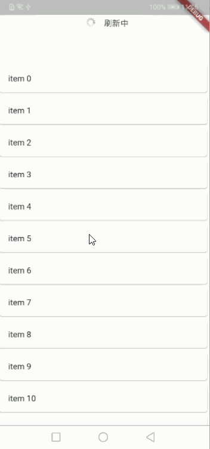
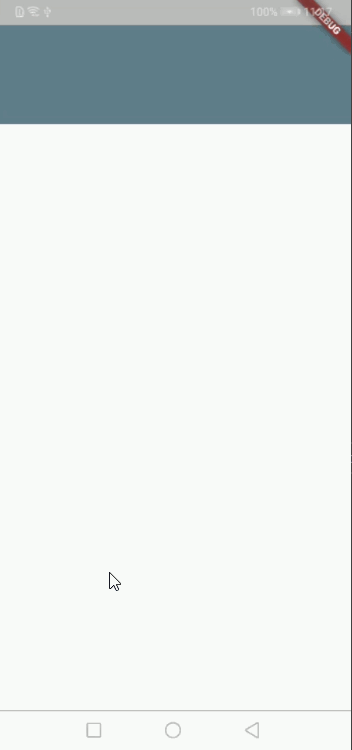

## Flutter 常用UI控件 ##

### 依赖方式 ###
在工程的pubspec.yaml文件中添加依赖

    dependencies:
	  flutter_ui:
	    git:
	      url: http://10.10.15.98/xiekun/FlutterUI.git
	      ref: v1.1.1

### RefreshLayout 上下拉刷新控件 ###
预览：

使用方式：

    class RefreshLayoutPage extends StatefulWidget {
	  @override
	  _RefreshLayoutPageState createState() => _RefreshLayoutPageState();
	}
	
	class _RefreshLayoutPageState extends State<RefreshLayoutPage> {
	  @override
	  Widget build(BuildContext context) {
	    return Scaffold(
	      body: RefreshLayout(
	        child: ListView.builder(
	          itemBuilder: buildItem,
	          itemCount: 30,
	          physics: ClampingScrollPhysics(),
	        ),
	        onRefresh: onRefresh,
	        onLoadMore: onLoadMore,
	        refreshMode: RefreshMode.BOTH,
	      ),
	    );
	  }
	
	  Widget buildItem(BuildContext context, int index) {
	    return Card(
	      child: Padding(
	        padding: EdgeInsets.all(15),
	        child: Text('item $index'),
	      ),
	    );
	  }
	
	  Future<void> onRefresh() async {
	    await Future.delayed(Duration(seconds: 2));
	  }
	
	  Future<void> onLoadMore() async {
	    await Future.delayed(Duration(seconds: 2));
	  }
	}

### SlideLayout 层叠滑动控件 ###
预览：

使用方式：

	class SlideLayoutPage extends StatefulWidget {
	  @override
	  _SlideLayoutPageState createState() => _SlideLayoutPageState();
	}
	
	class _SlideLayoutPageState extends State<SlideLayoutPage> {
	  @override
	  Widget build(BuildContext context) {
	    return Scaffold(
	      body: ListView(
	        children: <Widget>[
	          SizedBox.fromSize(
	            size: Size.fromHeight(100),
	            child: SlideLayout(
	              foreground: Container(
	                color: Colors.blueGrey,
	                child: Center(
	                  child: Image.asset('images/refresh_loading.png'),
	                ),
	              ),
	              background: DecoratedBox(
	                decoration: BoxDecoration(color: Colors.redAccent),
	                child: Center(
	                    child: Text('删除',)),
	              ),
	            ),
	          )
	        ],
	      ),
	    );
	  }
	}